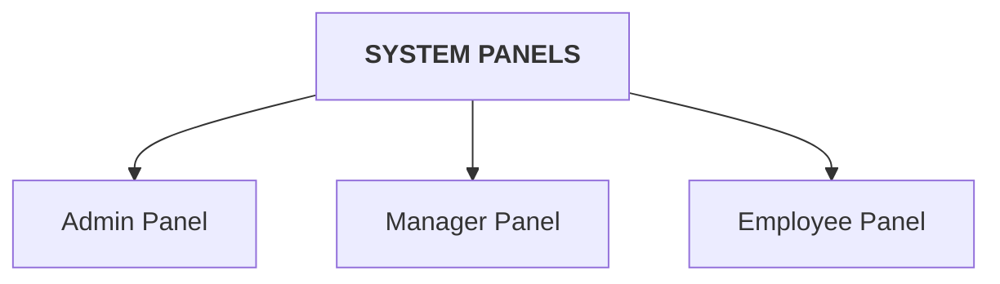

# Leave Management System - User Microservice

Welcome to the **User Microservice** of the Leave Management System. This service acts as the central hub for user identity, authentication, profile management, and role-based access control (RBAC) across the platform.

## System Panels & Architecture

Below is a visual representation of the capabilities divided among the three primary panels (Roles) supported by this microservice.

## Working flow :

### 1. Login Flow :

### 2. Reset Password Flow :

### 3. ADMIN/HR Workflow :

## Role Descriptions & Endpoints

### 1. ADMIN Panel
Admins manage the foundational organizational data and user lifecycle through the following sequence of actions:
*   **Provisioning:** Onboard new employees by creating user accounts with assigned roles (ADMIN/MANAGER/EMPLOYEE).
*   **Initialization:** Automatically trigger remote leave balance creation in the Leave Microservice and secure credential hashing.
*   **Communication:** Dispatch automated welcome emails containing system login URLs and initial credentials.
*   **Maintenance:** Monitor all registered employees and perform real-time updates to profiles, roles, or account statuses.
*   **Offboarding:** Deactivate user accounts and trigger exit notification emails during employee separation.
*   **Leave Management:** Create leave requests for employees and manage public holidays for the organization.
*   **Insights:** Provide organizational statistics and basic user data for internal AI chatbot queries and administrative dashboards.

**Admin Endpoints:**
* `GET /admin/get-users` 
    * **Response:** `List<UserResponse>` (id, userName, fullName, emailId, roleId, role, gender, active, companyId)

* `POST /admin/add-user`
    * **Request:** `UserRequest` (companyId, fullName, userName, userPassword, emailId, roleId, role, gender, active, createdBy)
    * **Response:** `SuccessResponse` (message: "User created!")

* `PUT /admin/update-user`
    * **Request:** `UserRequest` (userName [required], fullName, emailId, roleId, role, gender, active, userPassword, createdBy)
    * **Response:** `SuccessResponse` (message: "User updated!")

* `DELETE /admin/delete-user`
    * **Request:** `DeleteUser` (fullName, userName, emailId)
    * **Response:** `SuccessResponse` (message: "User deleted!")

* `GET /internal/users/count`
    * **Response:** `Long` (Total count of employees)

* `GET /internal/users/role/{role}`
    * **Response:** `List<BasicUserInfoForAI>` (userId, fullName, role, email)

* `GET /internal/users/search?name={name}`
    * **Response:** `List<BasicUserInfoForAI>` (userId, fullName, role, email)

### 2. MANAGER Panel
Managers utilize this service primarily for identity and access management:
*   **Authentication:** Securely log in using credentials to obtain JWT tokens for authorized platform access.
*   **Identity Management:** Access and verify personal profile data, including role and active status.
*   **Account Recovery:** Initiate secure password resets via email-based OTPs when credentials are lost.
*   **Security Updates:** Reset and update account passwords with modern cryptographic hashing (BCrypt).

**Manager Endpoints:**
* `POST /auth/login`
    * **Request:** `LoginRequest` (username, password [Base64 encoded])
    * **Response:** `LoginResponse` (token, userName, role, email, fullName, userId)

* `GET /auth/my-profile`
    * **Header:** `Authorization: Bearer <token>`
    * **Response:** `MyProfile` (companyId, userName, fullName, emailId, role, gender, active)

* `POST /auth/send-otp`
    * **Request:** `SendOtp` (email)
    * **Response:** `SuccessResponse` (message: "OTP sent!")

* `POST /auth/verify-otp`
    * **Request:** `VerifyOtp` (email, otp)
    * **Response:** `SuccessResponse` (message: "OTP verified!")

* `POST /auth/reset-password`
    * **Request:** `ResetPasswordRequest` (email, newPassword)
    * **Response:** `SuccessResponse` (message: "Password reset!")

### 3. EMPLOYEE Panel
Employees interact with the service to manage their profile and structural organizational data:
*   **Access:** Authenticate into the system and manage personal session security.
*   **Profile Review:** Retrieve personal details and confirm account standing.
*   **Workflow Preparation:** Fetch a list of active Managers to correctly select an approver during leave applications.
*   **Self-Service Recovery:** Perform end-to-end password recovery using the integrated OTP verification system.

**Employee Endpoints:**
* `POST /auth/login`
    * **Request:** `LoginRequest` (username, password [Base64 encoded])
    * **Response:** `LoginResponse` (token, userName, role, email, fullName, userId)

* `GET /auth/my-profile`
    * **Header:** `Authorization: Bearer <token>`
    * **Response:** `MyProfile` (companyId, userName, fullName, emailId, role, gender, active)

* `GET /auth/get-managers`
    * **Response:** `List<ManagerResponse>` (id, fullName, emailId)

* `POST /auth/send-otp`
    * **Request:** `SendOtp` (email)
    * **Response:** `SuccessResponse` (message: "OTP sent!")

* `POST /auth/verify-otp`
    * **Request:** `VerifyOtp` (email, otp)
    * **Response:** `SuccessResponse` (message: "OTP verified!")

* `POST /auth/reset-password`
    * **Request:** `ResetPasswordRequest` (email, newPassword)
    * **Response:** `SuccessResponse` (message: "Password reset!")
